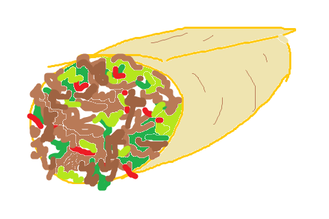
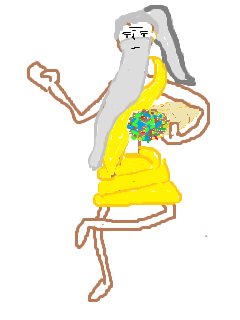

Gonna write a server game using Laravel to reproduce a bug in my plugin

## Kebab Republic

To make this work, you want to first create a boilerplate Laravel project somewhere, and then copy-replace contents of this repo there.

Withing this project I wanted to create a mind game where both sides have a certain amount of "Spice" (100) and each turn to decide how much spice should they spend. The player that spent more spice wins the round, but has less spice to spend in the following rounds. To win the match, you need to win certain amount of tims... But threw it somewhere halfway. Stopped somewhere around the moment when I implemented an AI for this game (in /scripts/ you may find the algorithm I used for AI "training")
